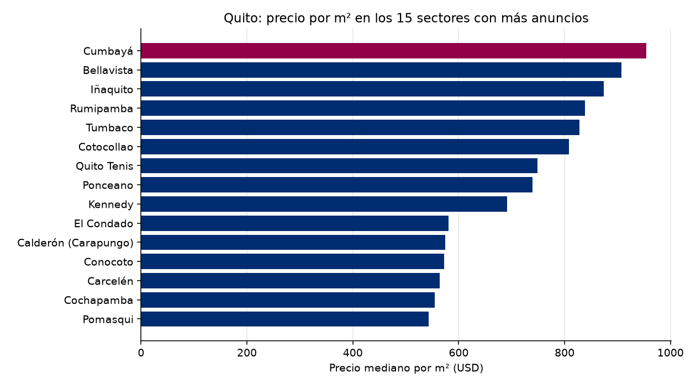

# Observatorio de Referencia · Mercado inmobiliario de Quito
Reporte del 2026-10-10

## Lo más importante
- Anuncios analizados: **1072**
- Precio mediano por m²: **USD 644** (+0.00 % contra la corrida anterior)
- Sin alerta. (umbral: 5.0 %)

## Calidad de los datos
- Anuncios recibidos: 2352; quedaron 1072 tras la limpieza.
- Descartados por no es venta: 402
- Descartados por no es vivienda: 687
- Descartados por no esta activo: 115
- Descartados por sin precio: 2
- Descartados por area imposible: 9
- Descartados por duplicado con otro id: 6
- Descartados por precio m2 imposible: 1
- Descartados por precio m2 extremo: 58
- Precios corregidos por punto de miles: 3

## Por sector (los 20 con más anuncios)
| Sector | Anuncios | Mediana USD/m² | Precio mediano USD |
|---|---|---|---|
| Conocoto | 56 | 572 | 105,000 |
| Iñaquito | 37 | 874 | 155,000 |
| Tumbaco | 35 | 828 | 181,500 |
| Calderón (Carapungo) | 32 | 574 | 74,962 |
| Quito Tenis | 30 | 749 | 204,250 |
| Cumbayá | 28 | 954 | 270,000 |
| Rumipamba | 27 | 838 | 149,000 |
| Bellavista | 26 | 907 | 233,500 |
| El Condado | 24 | 581 | 144,000 |
| Cotocollao | 22 | 808 | 70,557 |
| Ponceano | 19 | 739 | 86,000 |
| Carcelén | 19 | 564 | 86,000 |
| Cochapamba | 18 | 555 | 125,000 |
| Pomasqui | 15 | 543 | 115,000 |
| Kennedy | 13 | 691 | 108,000 |
| San Antonio | 12 | 534 | 84,000 |
| San Isidro Del Inca | 11 | 748 | 93,000 |
| Union Nacional | 10 | 740 | 125,000 |
| Mariscal Sucre | 10 | 719 | 117,000 |
| Alangasí | 10 | 502 | 179,500 |

## El entorno económico del Ecuador
- Inflación anual (Banco Mundial): 0.7% (2025)
- Crecimiento del PIB (Banco Mundial): 3.7% (2025)
- Crecimiento del PIB (FMI): 3.7% (2025)
- Crédito al sector privado (% del PIB, Banco Mundial): 58.9% (2025)

## De dónde salen los datos
- Anuncios: remax_en_vivo
- Macroeconomía: Banco Mundial y FMI
